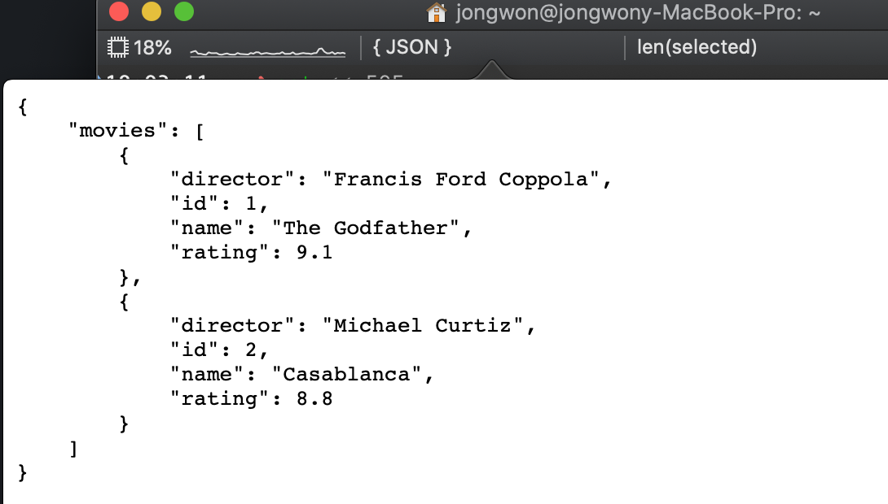
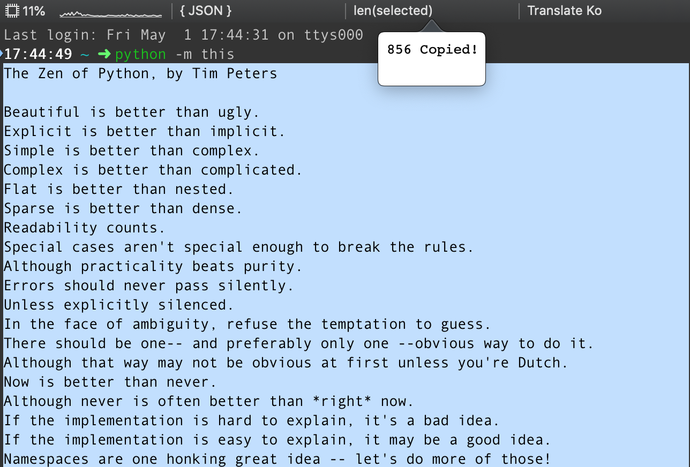
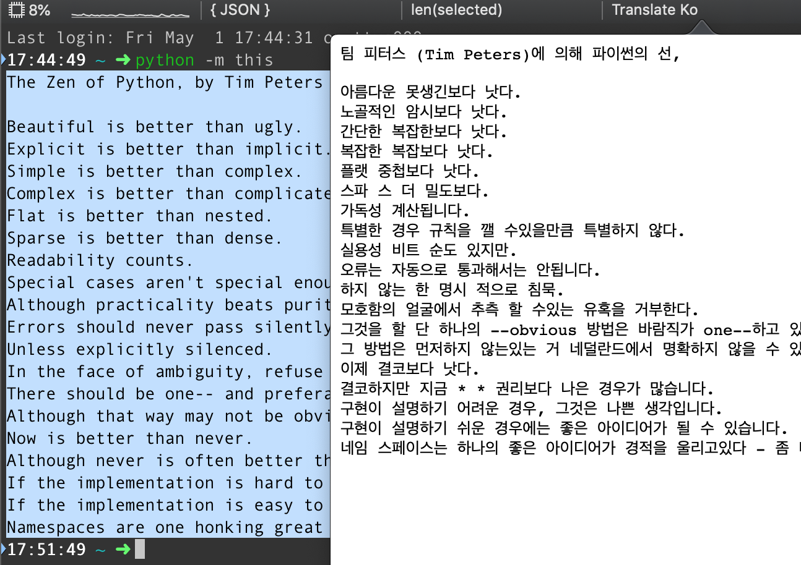
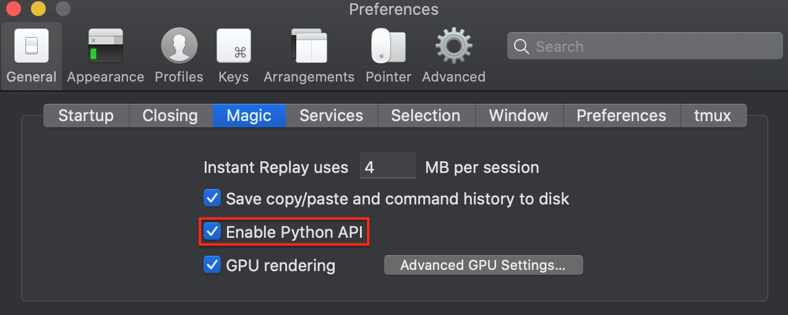
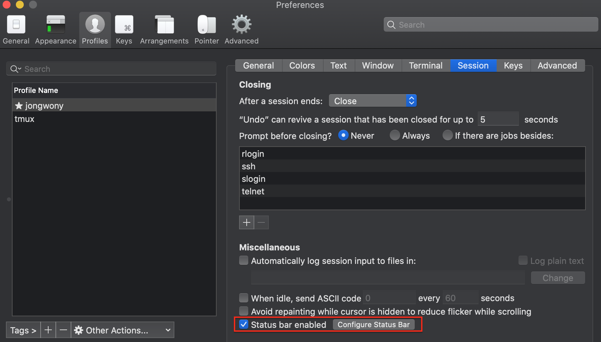
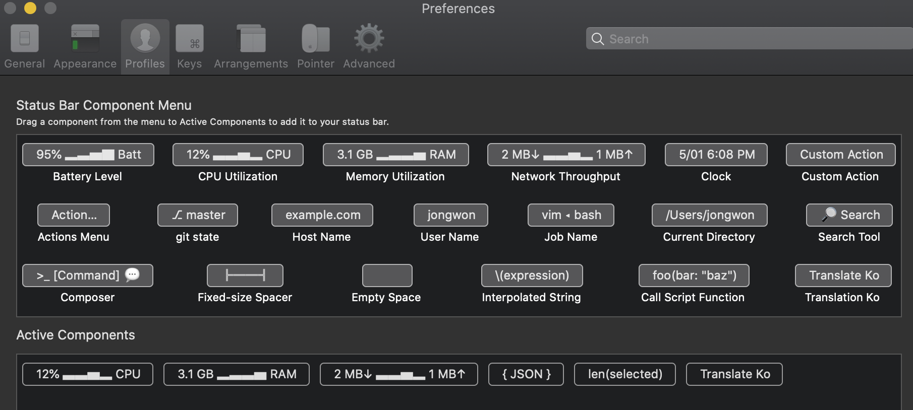

# iTerm2 Scripts

Python API

## Status Bar Examples

### json test

This is [iterm2 built in example.](https://iterm2.com/python-api/examples/jsonpretty.html#jsonpretty-example)



### len(selected)



... and Paste string length!

### translate ko



## Install

```shell script
git clone https://github.com/jongwony/iterm2_scripts.git
cd iterm2_scripts
sh symlink_init.sh
```




```shell script
sh install.sh
```

